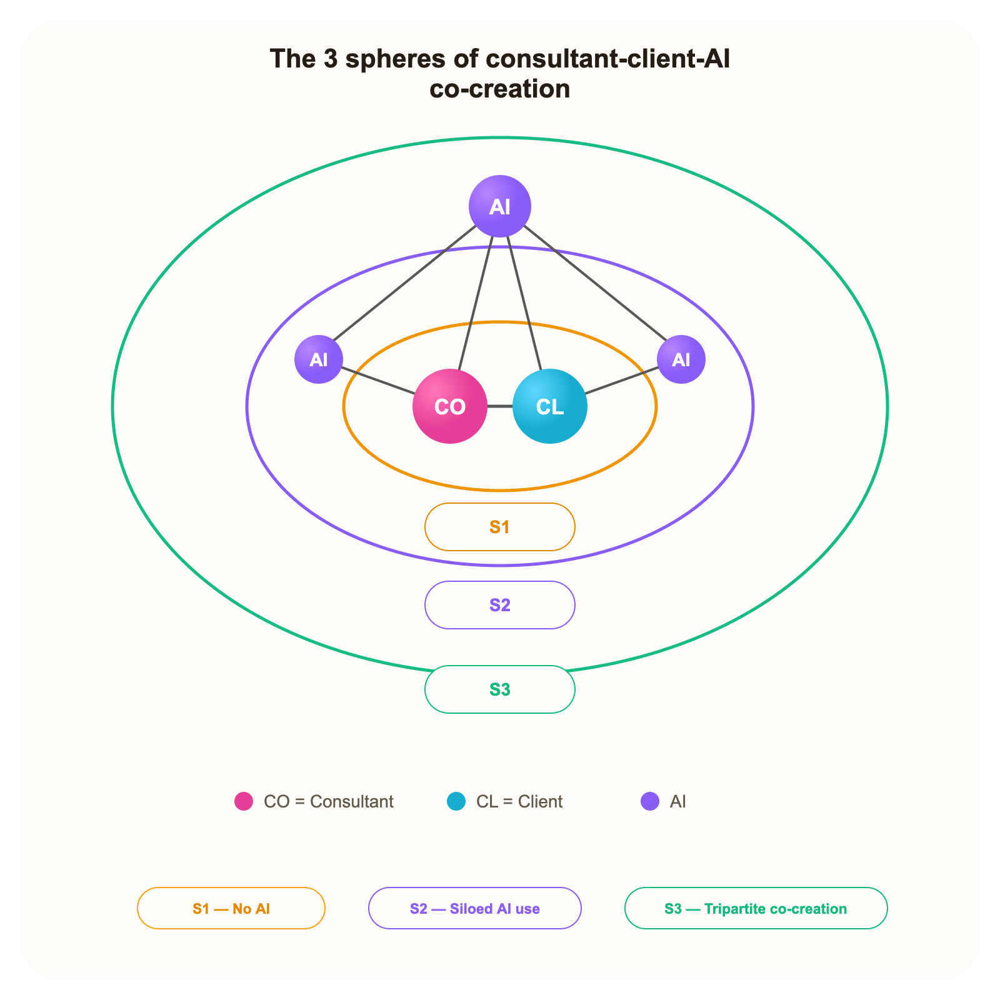

# Perceived value co-creation in AI-era consulting — an exploratory framework

_Yunes, Clément - University of Bordeaux_

This text is also available online: [https://s1s2s3.vercel.app](https://s1s2s3.vercel.app)

## Table of contents

**English version**

| Section | Page |
| --- | ---: |
| 1. Research positioning | p. 2 |
| 2. Theoretical framework | p. 3 |
| 3. Observation framework | p. 8 |
| 4. Illustration | p. 10 |

<div style="page-break-after: always;"></div>

## 1. RESEARCH POSITIONING

### Understanding perceived value co-creation in consulting in the AI era

### THE QUESTION

AI-augmented consulting is often presented as a promise of superior value for clients, because it enables work to be produced faster, better, stronger, cheaper and more safely. Yet value is subjective, and the client’s perception of it is by no means automatic.

In consulting, perceived value is not simply delivered to the client; it is built through the relationship, the mission experience, and the client’s appropriation of the managerial knowledge produced, which ultimately enables the problem at hand to be resolved. Perceived value is therefore the outcome of co-creation.

Yet the massive introduction of AI into consulting practices changes the situation of this co-creation. It transforms how contributions are produced, made visible, attributed to actors, appropriated and mobilized in the managerial action of the client organization, where perceived value alone actually takes shape. This research explores this transformation at work. How is the perceived value of consulting thus reconfigured by AI? Under what conditions is it strengthened or weakened?

In other words, how does the integration of AI in consulting practices reconfigure the co-creation of perceived value for clients?

### WHY IT MATTERS

The integration of AI into consulting does not necessarily generate superior value for the client. Paradoxically, AI can both strengthen the consulting production process and weaken the co-creation situation and, consequently, client-perceived value (low legibility of the process or result, questioning of the legitimacy of the advice produced, blurring of contributions, lack of appropriation of the managerial knowledge produced). This is all the more salient because the management consulting literature suggests that the co-creation of managerial knowledge, and therefore of client-perceived value, has historically remained unfinished (in favour of a simple transfer of best practices). The success of the AI-augmented consultant model therefore depends on a better understanding of the conditions under which this perceived value co-creation occurs in the AI era.

### AN OPEN QUESTION

At the theoretical level, this research mobilizes a dual perspective (marketing and information systems), analyzed through the prism of its application to the consulting field, and brings an original perspective to it: to our knowledge, there is no unified framework for exploring the pressing question of perceived value co-creation in consulting in the AI era, even though this question is central to guiding the necessary transformation of consulting practices.

• The marketing literature documents perceived value (definition, central role, measurement scale, and the conditions of its realization, namely co-creation).

• The information systems literature offers analytical frameworks for AI (capabilities, limits, risks), the conditions of its adoption, the sociotechnical system (role distribution, modes of interaction, attribution of contributions), its effects on production (automation vs augmentation), and knowledge management (augmentation vs impoverishment).

• Academic work attempting to synthesize these two bodies of literature around the perceived value of consulting remains rare. Work on consulting focuses on the purposes of consulting (technical and political), discusses its value (sources, conditions of formation, measurement), and the necessary transformation of the business model. This research contributes to that synthesis by focusing on the specific link between perceived value co-creation and the integration of AI into consulting practices, which to our knowledge has not yet been explored.

At the praxeological level, our analysis of the “grey” literature observes that consulting actors are indeed integrating AI into their practices while exploring possibilities for business model innovation. By focusing on the conditions under which consulting value is co-created in the AI era and ultimately perceived by the client, this research should help shed light on these initiatives.

## 2. THEORETICAL FRAMEWORK

We formulate three research propositions to explore how the integration of AI reconfigures perceived value in consulting. These propositions are derived from our literature review and articulated in a sequential order (P1, P2, P3). P1 sets out the dimensions of consulting perceived value that are reconfigured in the AI era; P2 sets out the mediating mechanism, namely transparency. P3 sets out the conditions of the reconfiguration, which allow P2 to operate.

### THE ABSENCE OF AN EXPLORATORY FRAMEWORK

The literature on perceived value in knowledge-intensive activities (such as consulting) identifies three central dimensions in the formation of perceived value: functional, emotional and social (Arslanagic-Kalajdzic & Zabkar, 2017). We take these up by adjusting them through an original framework that proposes a causal sequencing adapted to consulting and to our research framework: relational, processual and cognitive dimensions.

Consulting is characterized by the opacity and agility of its practices (Christensen, 2013); AI integration, because of its intangible character, reinforces these attributes. Through a dedicated observational framework that formalizes the sequence through which perceived value is co-created in consulting missions, we therefore seek to structure the empirical observation of the conditions under which consulting perceived value is reconfigured in the AI era.

The absence of an exploratory framework is both one of the contributions of this research and an acknowledged difficulty: no existing framework synthesizes these links into a unified causal sequence applied to perceived value in consulting, explicitly names its three dimensions (relational, processual, cognitive), or theorizes how AI integration contingently reconfigures each link — including these micro-activities through which legitimacy is produced.

The consulting literature empirically supports two constituent links between these dimensions: relational trust as a precondition for processual engagement (Nikolova et al. 2014; Glückler & Armbrüster 2003), and the co-creation experience as a condition of cognitive appropriation — including the client’s absorptive capacity as a decisive factor (Oesterle et al. 2020; Aarikka-Stenroos & Jaakkola 2012). In addition, from a pragmatist perspective, Bourgoin (2014) observes that the relational dimension of perceived value does not emerge spontaneously — it is actively produced through deliberate micro-activities of valuation by which consultants build their legitimacy throughout the mission.

At the same time, broader literature on management and knowledge work theorizes mechanisms that remain untested in consulting contexts: the blurring of contributions in human-AI systems (Raisch & Krakowski 2020), the recursive augmentation of organizational knowledge through AI (Harfouche et al. 2023), and the implications of delegation frameworks in hybrid human-AI systems (Baird & Maruping 2021).

### THE THREE PROPOSITIONS

#### P1 — Multidimensional reconfiguration of perceived value

The integration of AI into consulting missions reconfigures client-perceived value along three interdependent dimensions — relational (trust, legitimacy and political judgment, actively produced through micro-activities of valuation), processual (the co-creation experience itself — its nature, legibility and role distribution), and cognitive (newly co-produced managerial knowledge and capabilities, whose nature, richness and perceived author are reconfigured by AI). The political dimension of consulting missions (i.e. “consensus-building”, Turner, 1982), because of its exogenous character, is not considered a fourth dimension of perceived value. We treat it as the context in which legibility, attribution and appropriation affect the ability to carry the outputs. AI does not reconfigure the perceived value of consulting in the AI era uniformly. Its effect on each dimension of perceived value (relational, processual, cognitive) depends on how it is introduced and how the client interprets it. The same AI integration may amplify perceived value in one configuration and erode it in another. The three dimensions of perceived value in AI-era consulting follow the R→P→C sequence, with a proposed feedback loop R ← P (an original theoretical proposition of this framework, not directly anchored in the literature). AI reconfigures each link contingently — by amplifying or destabilizing it — according to P2 and P3. Value co-destruction (Plé & Cáceres 2010; Lumivalo et al. 2024) constitutes the boundary condition when P2 and P3 fail simultaneously.

#### P2 — Transparency as the mediating mechanism

Transparency is the mediating mechanism of perceived value in consulting in the AI era. Transparency is understood here as the intelligibility of the AI-assisted system through its observable effects (Ananny and Crawford, 2018). Our analytical framework distinguishes performative transparency (the consultant’s disclosure of AI use) from substantive transparency (the consultant’s mediation of AI interactions and outputs). Substantive transparency weighs more heavily on perceived value because it supports client appropriation. According to the understanding retained in this research, transparency in a sociotechnical system cannot be reduced to a punctual act of disclosure, because disclosure alone does not make the mechanisms of the system intelligible. It must instead be assessed through the observable effects it produces across the system. This is why the framework distinguishes performative transparency — disclosing AI use in the mission in order to signal openness and foster trust — from substantive transparency — the consultant’s mediation, for the client, of AI-produced interactions and results, in order to offer contextual interpretation and enable their conversion into managerial knowledge. Thus, our proposition, which remains to be verified, is that substantive transparency has a stronger influence on perceived value than performative transparency alone, because it fosters the client’s appropriation of consulting outputs (Albu & Flyverbom 2019; Ciampi 2017). P2 therefore treats substantive transparency — rather than mere disclosure — as the mediating mechanism through which AI integration shapes perceived value, depending on the conditions of P3.

#### P3 — Moderation conditions

Three categories of contingency determine whether P2 produces correct attribution: relational level (prior trust capital), situational level (mission phase and political stakes), and actor level (AI literacy and algorithm aversion). These contingencies are not all, strictly speaking, client-side: only actor-level conditions are directly located on the client side, while relational and situational contingencies exceed the client alone. Political stakes are therefore integrated as a situational contingency, not as the central object of the research. In a contingent logic, several levels of conditions may therefore moderate the transparency mechanism posited in P2. However, this research empirically and primarily retains actor-level contingencies, not because they exhaust the phenomenon, but because they constitute, in the AI era, the most theoretically distinctive and most accessible focus in a single exemplary qualitative case design, as we envisage it. AI literacy (competence variable, Long et al., 2020) and algorithm aversion (attitudinal variable, Dietvorst et al. 2015) are distinct: a client can be AI-literate while still displaying aversion to AI. AI literacy determines whether the client can follow the consultant’s explicitation, distinguish the contribution of AI from the consultant’s judgment, and understand the limits of what has been produced. Algorithm aversion determines whether these same contributions, even when understood, are accepted as legitimate inputs to managerial judgment. Substantive transparency can therefore fail in two ways: either because the explanation is not cognitively appropriate, or because it is understood but normatively disqualified. Correct attribution requires both intelligibility and minimal acceptance. In this framework, correct attribution is treated as an important observable condition of client appropriation and, through that appropriation, as a pathway through which transparency acts on perceived value.

### THE R → P → C MODEL

#### R / P / C dimensions

**R — Relational**

Trust, legitimacy and political judgment — actively produced, increasingly ambiguous in human-AI systems

**P — Processual**

The co-creation experience itself — its nature, legibility and role distribution, reconfigured by AI as a third actor

**C — Cognitive**

The ability to interpret, understand and evaluate what was co-produced — so mission outputs become intelligible, assessable, appropriable and usable as managerial knowledge

SEQUENCE R → P → C with proposed feedback loop R ← P

#### How AI contingently shapes the R → P → C chain

**Figure — How AI contingently shapes the R → P → C chain**

```text
R (Relational)  →  P (Processual)  →  C (Cognitive)
P  →  R (feedback loop)
```

The original contribution lies less in inventing the R → P → C sequence than in theorizing how AI amplifies, destabilizes or reverses each relation contingently. The causal architecture of the chain remains stable, that is, independent of AI integration into consulting practices: relational anchoring (R) enables processual engagement (P), and processual engagement supports cognitive appropriation (C). What AI modifies, through the mediating mechanism (P2), is the stability of each link — positively or negatively, depending on the contingencies (P3).

#### R → P

**Positive reconfiguration**

Visible orchestration and credible legitimacy-building can deepen processual engagement when AI use is understood and accepted.

**Negative reconfiguration**

Masked AI use can weaken legitimacy and retrospectively delegitimize the process in the eyes of the client, for example if the hidden contribution is subsequently discovered by the client.

**Contingencies**

Protected through P2, but only conditionally through P3.

#### R ← P

**Positive reconfiguration**

A fluid co-creation experience can reinforce consultant legitimacy as the mission unfolds.

**Negative reconfiguration**

Spectacular AI outputs may shift credit from the consultant to the AI, inverting the expected feedback loop.

**Contingencies**

Depends on the legibility of contributions by the client (P2), their AI literacy and their algorithm aversion (P3).

#### P → C

**Positive reconfiguration**

Visible co-creation with AI may enrich the diversity and novelty of insights when the client is cognitively engaged in the process.

**Negative reconfiguration**

AI may also decouple knowledge from co-production: the client receives outputs without genuinely participating in how they were generated.

**Contingencies**

Depends on the consultant’s substantive explicitation (P2) and, through P3, on intelligibility, acceptance and relational and situational conditions.

Value co-destruction (Plé & Cáceres 2010; Lumivalo et al. 2024) constitutes the boundary condition when P2 and P3 fail simultaneously.

### THE NEED FOR AN OBSERVATIONAL FRAMEWORK OF PERCEIVED VALUE CO-CREATION IN AI-ERA CONSULTING

The research propositions explore the conditions under which AI integration generates more co-created perceived value — through the relational, processual and cognitive dimensions of consulting. Yet work on perceived value shows how multidimensional and subjective this notion is, and therefore by definition difficult to evaluate. For some, it is the measure by which a client feels in a better or less favorable situation through consumption-related experiences (Grönroos and Voima, 2013). For others, consensual factors characterize it, such as comparative judgment, personal, dynamic and contextual character (Rivière and Mencarelli, 2012). In the consulting domain, which by definition evolves in ambiguous and uncertain contexts (Svensson, 2010), we therefore do not attempt to establish a measurement scale, and prefer to adopt the pragmatist approach, which observes perceived value at work by focusing on valuation activities as an additional layer of justification for consulting (Bourgoin, 2014). What happens to these activities when AI blurs actors’ contributions? To observe the reconfiguration of consulting perceived value in the AI era, it therefore seems necessary to restate an observational framework specific to consulting and AI, enabling the effects of AI integration on perceived value co-creation in consulting situations to be assessed through our research propositions (P1, P2, P3). Our observational framework (S1/S2/S3) situates each consultant-client interaction within a configuration of co-creation, inside the joint sphere of value co-creation (Grönroos and Voima, 2013), making the theoretical mechanisms of P1, P2 and P3 empirically observable.

- S1 — Human dyad. AI absent. Relational baseline.
- S2 — AI in silo. Attribution and transparency latent.
- S3 — Tripartite co-creation. All dimensions observable.

### Observational sequencing

#### Initial co-creation situation

The initial co-creation situation S1 is therefore located without AI (the classical consultant-client dyad). Observed through our proposition P1 (multidimensional reconfiguration of perceived value), when the consultant’s relational legitimacy is not already available, sequences that begin in S1 may help build it before a more explicit integration of AI in S2/S3. When prior trust capital already exists — including from previous interactions or earlier missions — other entry points remain possible. In all cases, transparency (P2) must be calibrated to the client’s interpretive profile (P3).

### OBSERVATIONAL STATUS

S1/S2/S3 is an empirical observational framework, not a new theoretical proposition.

Each situation makes certain mechanisms particularly observable: S1 the relational baseline, S2 latent transparency and attribution, S3 the simultaneous observability of the three dimensions.

## 3. OBSERVATION FRAMEWORK

### The 3 spheres of perceived value co-creation in consulting in the AI era

The diagram of the 3 consultant-client-AI co-creation spheres constitutes the observational framework through which the research propositions on perceived value co-creation are examined empirically, across three consultant-client-AI configurations. Within this framework, the dynamic and temporal orchestration of co-creation situations may also constitute a managerial lever, without being a fixed prescription.

**Figure — The 3 spheres of consultant-client-AI co-creation**



#### S1 — No AI

Consultant and client co-create in a human dyad. AI is totally absent. The consultant remains the sole central and visible actor of the co-creation process, building relational legitimacy through micro-activities of valuation, i.e. singularization, authority signalling and progressive demonstrations of competence (Bourgoin, 2014). This relational anchoring conditions the client’s openness to subsequent AI integration. Observable: trust formation, political judgment, legitimacy construction.

#### S2 — Siloed AI use

AI is used separately by the consultant and/or the client, without shared orchestration or substantive explicitation. The consultant nevertheless tends to retain the visible central role, even when AI contributes in the background. The risk of blurred attribution of consultant / AI contributions by the client is latent — relational legitimacy may be retrospectively weakened if hidden AI contributions are discovered. Observable: transparency modalities, attribution patterns, legitimacy fragility.

#### S3 — Tripartite co-creation

Co-creation unfolds in an explicit triad: consultant, client and AI. The consultant no longer monopolizes the central role; orchestration, attribution and legitimacy become more distributed and more subject to negotiation. Observable: the three propositions (P1, P2, P3) are simultaneously observable. The cognitive dimension of perceived value may be richer — but the author of the production becomes contestable (Raisch & Krakowski 2020; Baird & Maruping 2021).

## 4. ILLUSTRATION

### Fictional consulting scenario: digital platform audit

Thomas (consultant) and Marie (client, TechX)

This scenario illustrates, in a fictional and purely indicative way, perceived value co-creation at work in consulting through the R→P→C sequence, examined through the three research propositions (P1, P2, P3) and the S1/S2/S3 observational framework, including their capacity to be politically defended within the organization.

Fictional 10-week mission: digital platform audit. The mission is structured into three major consulting stages. Each sub-phase indicates the co-creation configuration observed (S) and the research propositions most directly examined (P).

### Mission phases

**Figure — Mission phases**

| Phase | Sous-étape | S | P | R/P/C |
| --- | --- | --- | --- | --- |
| 1. Scoping | Exploration — Wk 1-2 | S1 | P1 | R |
| 1. Scoping | Preparation — Wk 3 | S2 | P2, P3 | R, P |
| 2. Analysis | Collaborative analysis — Wk 4-6 | S3 | P1, P2, P3 | R, P, C |
| 2. Analysis | Refinement — Wk 7-8 | S2/S3 | P1, P2 | P, C |
| 2. Analysis | Mutual validation — Wk 9 | S2 | P1, P3 | C |
| 3. Recommendations | COMEX presentation — Wk 10 | S1 | P3 | R, C |
| postmission | Retrospective — Post | Post | P1, P2, P3 | R, P, C |

**1. Scoping — Wk 1-3**

Relational anchoring and initial framing of the mission.

**2. Analysis — Wk 4-9**

Joint inquiry, refinement and progressive validation of interpretations.

**3. Recommendations — Wk 10**

Formalization and presentation of recommendations.

### Sub-steps

#### Exploration — Wk 1-2

**Stage**

scoping

**Situation**

S1

**Propositions examined**

P1

**Perceived value dimensions**

R

Individual face-to-face interviews with TechX senior executives. Thomas builds relational legitimacy through active listening, authority signalling and ramp-up displays of competence. No AI involved.

Primary observable: R (relational baseline) — P1 baseline for subsequent configurations

#### Preparation — Wk 3

**Stage**

scoping

**Situation**

S2

**Propositions examined**

P2, P3

**Perceived value dimensions**

R, P

Thomas uses AI to transcribe and thematically structure the interviews without informing Marie. He presents a structured synthesis attributed to his own judgment.

Primary observable: P2 (zero transparency) — P3 (attribution mechanism latent) — Risk of retrospective delegitimisation

#### Collaborative analysis — Wk 4-6

**Stage**

analysis

**Situation**

S3

**Propositions examined**

P1, P2, P3

**Perceived value dimensions**

R, P, C

Weekly tripartite sessions: Thomas mobilizes AI visibly as an explicit component of the exchange, Marie challenges outputs, and insights are co-constructed within an explicit triad. All three propositions are simultaneously observable.

Primary observable: P1 (all dimensions R, P, C) — P2 (substantive vs performative) — P3 (AI literacy and algorithm aversion)

#### Refinement — Wk 7-8

**Stage**

analysis

**Situation**

S2/S3

**Propositions examined**

P1, P2

**Perceived value dimensions**

P, C

Thomas alternates between silo AI use (structuring scenarios) and visible co-creation with Marie (validating options). Transparency is selective and strategic.

Primary observable: P2 (performative vs substantive) — P1 (processual reconfiguration) — Attribution ambiguity

#### Mutual validation — Wk 9

**Stage**

analysis

**Situation**

S2

**Propositions examined**

P1, P3

**Perceived value dimensions**

C

Thomas finalises recommendations using AI for stress-testing. Marie reviews outputs but cannot fully evaluate the AI-assisted analytical chain.

Primary observable: P3 (AI literacy as limiting factor) — P1 (cognitive dimension) — Absorptive capacity

#### COMEX presentation — Wk 10

**Stage**

recommendations

**Situation**

S1

**Propositions examined**

P3

**Perceived value dimensions**

R, C

Thomas presents to the executive committee without visible AI. Political judgment, narrative construction and authority remain fully human on the surface. Yet acceptance of the recommendations still depends on the legibility and appropriability of the AI-assisted work if the analytical chain is questioned or disclosed. Marie defends the recommendations.

Primary observable: R (political legitimacy and judgment) + C (evaluation of the analytical chain) — P3 (COMEX AI literacy and disposition toward AI-assisted analysis as contextual moderator)

#### Retrospective — Post

**Stage**

postmission

**Situation**

Post

**Propositions examined**

P1, P2, P3

**Perceived value dimensions**

R, P, C

Retrospective assessment of perceived value across the three dimensions. Which configuration generated the greatest perceived value across its relational, processual and cognitive dimensions — and under what conditions?

Primary observable: P1 full (R, P, C) across S1/S2/S3 — P2 and P3 as moderating conditions


