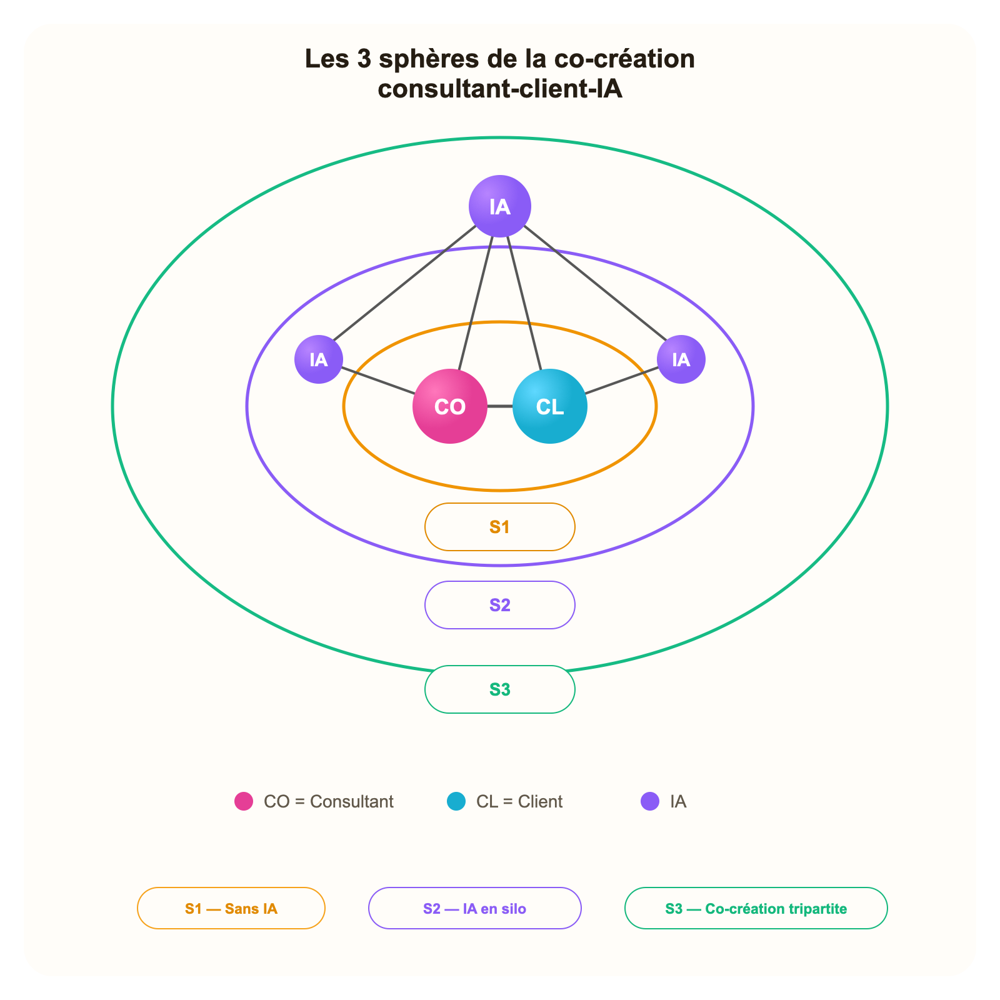

# Document complémentaire des contenus de l'artefact

Ce document restitue, mot pour mot, la version française des contenus textuels de l'application interactive. Il est destiné à une lecture humaine hors interface et régénéré depuis content.js, source maître des contenus de l'app.

Application en ligne : [https://s1s2s3.vercel.app](https://s1s2s3.vercel.app)

## Table des matières

**Version française**

| Partie | Page |
| --- | ---: |
| 1. Positionnement de la recherche | p. 2 |
| 2. Cadre théorique | p. 3 |
| 3. Cadre d'observation | p. 8 |
| 4. Illustration | p. 10 |

<div style="page-break-after: always;"></div>

## 1. POSITIONNEMENT DE LA RECHERCHE

### Comprendre la co-création de valeur perçue dans le conseil à l'ère de l'IA

### LA QUESTION

Le conseil augmenté par l'IA est souvent présenté comme une promesse de valeur supérieure pour les clients, car il permet de produire plus vite, mieux, plus fort, moins cher, plus sûr. Or, la valeur est subjective, et sa perception par le client, en rien automatique.

Dans le conseil, la valeur perçue n'est pas simplement délivrée au client, elle se construit dans la relation, l'expérience de la mission, l'appropriation par le client des connaissances managériales produites, qui permettent in-fine, la résolution du problème à traiter. La valeur perçue est donc le fruit d'une co-création.

Or, l’introduction massive de l’IA dans les pratiques du conseil, modifie la situation de cette co-création. Elle transforme la manière dont les contributions sont produites, rendues visibles, attribuées aux acteurs, appropriées et mobilisées dans l'action managériale de l’organisation cliente, où seule se forme effectivement la valeur perçue. Notre recherche explore cette transformation à l’œuvre. En quoi la valeur perçue du conseil est-elle ainsi reconfigurée par l’IA ? Sous quelles conditions se renforce-t-elle ou se fragilise-t-elle ?

Autrement dit, comment l’IA reconfigure-t-elle la valeur perçue des missions de conseil ?

### POURQUOI CELA COMPTE

L'intégration de l'IA dans le conseil, ne génère pas nécessairement une valeur supérieure pour le client. Paradoxalement, l’IA peut à la fois renforcer le processus de production du conseil et fragiliser la situation de co-création, et par conséquent la valeur perçue par le client (faible lisibilité du processus ou du résultat, questionnement sur la légitimité du conseil produit, floutage des contributions, défaut d’appropriation des connaissances managériales produites). D’autant que la littérature sur le conseil en management, suggère que la co-création de connaissances managériales, et par la même, de valeur perçue par le client, demeure historiquement inaboutie (au profit d’un simple transfert de bonnes pratiques). Dès lors, la réussite du modèle de consultant augmenté par l’IA, dépend d’une meilleure compréhension des conditions dans lesquelles cette co-création de valeur perçue se produit à l’ère de l’IA.

### UNE QUESTION LAISSÉE OUVERTE

Au plan théorique, notre recherche mobilise une double perspective (marketing, systèmes d’information), analysée par le prisme de son application au domaine du conseil (voir ci-dessous).

Notre recherche apporte une perspective originale : à notre connaissance, il n’existe pas de cadre unifié pour explorer la question pressante de la co-création de valeur perçue du conseil à l’ère de l’IA, pourtant centrale pour guider la nécessaire transformation des pratiques du conseil.

• La littérature marketing, documente la valeur perçue (définition, rôle central, échelle de mesure, conditions de sa réalisation, à savoir la co-création).

• La littérature sur les systèmes d’informations, propose des cadres d’analyse de l’IA (capacités, limites, risques), des conditions de son adoption, du système socio-technique (répartition des rôles, modalités d’interaction, attributions des contributions), des effets sur la production (automatisation vs augmentation) et la gestion des connaissances (augmentation vs appauvrissement).

• Les travaux académiques qui tentent une synthèse de ces deux corpus autour de la valeur du conseil, sont rares. Les recherches se focalisent sur les buts du conseil (techniques et politiques), en discutent la valeur (conditions de sa formation, mesure) ou la transformation du modèle d’affaires. Nos travaux contribuent à cette synthèse en se focalisant sur l’exploration de la valeur perçue à laquelle nous intégrons la dimension spécifique liée à l’IA.

An plan praxéologique, notre analyse de la littérature « grise », observe que les acteurs du conseil intègrent effectivement l’IA dans leurs pratiques, tout en explorant les possibilités d’innovation des modèles d’affaires. Nos travaux, en se focalisant sur les conditions dans lesquelles la valeur du conseil est co-créée à l’ère de l’IA et au final, perçue par le client, doivent pouvoir éclairer ces initiatives.

## 2. CADRE THÉORIQUE

Nous formulons trois propositions de recherche pour explorer la manière dont l'intégration de l'IA reconfigure la valeur perçue dans le conseil. Ces propositions sont dérivées de notre revue de la littérature, et articulées selon un ordre séquentiel (P1, P2, P3). P1 pose les dimensions de la valeur perçue du conseil, qui font l’objet d’une reconfiguration à l’ère de l’IA ; P2 en pose le mécanisme médiateur, à savoir la transparence. P3 pose les conditions de la reconfiguration, qui permettent à P2 de fonctionner.

### L’ABSENCE DE CADRE D’EXPLORATION

La littérature sur la valeur perçue des activités à forte intensité de connaissances (telles que le conseil), identifie trois dimensions centrales de formation de la valeur perçue : fonctionnelle, émotionnelle et sociale (Arslanagic-Kalajdzic & Zabkar, 2017). Nous les reprenons, en les ajustant avec un cadre original qui propose un séquencement causal, adapté au cas du conseil et au cadre de notre recherche : dimension relationnelle, processuelle et cognitive.

Le conseil se distingue par l’opacité et l’agilité de ses pratiques (Christensen, 2013) ; l’intégration de l’IA, par son côté intangible, y renforce ces attributs. Nous cherchons ainsi, au travers d’un cadre d’observation dédié, qui formalise la séquence par laquelle la valeur perçue se co-crée dans les missions de conseil, structurer l’observation empirique des conditions de la reconfiguration de la valeur perçue du conseil à l’ère de l’IA.

L’absence de cadre d’exploration est à la fois l’un des apports de notre recherche, et une difficulté assumée : aucun cadre existant ne synthétise ces liens dans une séquence causale unifiée appliquée à la valeur perçue dans le conseil, ne nomme explicitement ses trois dimensions (relationnelle, processuelle, cognitive), ni ne théorise la manière dont l'intégration de l'IA reconfigure chaque lien de manière contingente — y compris ces micro-activités de production de légitimité.

La littérature sur le conseil étaie empiriquement deux liens constitutifs entre ces dimensions : la confiance relationnelle comme précondition de l'engagement processuel (Nikolova et al. 2014 ; Glückler & Armbrüster 2003), et l'expérience de co-création comme condition de l'appropriation cognitive — y compris la capacité d'absorption du client comme facteur décisif (Oesterle et al. 2020 ; Aarikka-Stenroos & Jaakkola 2012). En outre, dans une perspective pragmatiste, Bourgoin (2014) observe, que la dimension relationnelle de la valeur perçue n'émerge pas spontanément — elle est activement produite à travers des micro-activités délibérées de mise en valeur par lesquelles les consultants construisent leur légitimité tout au long de la mission.

Parallèlement, une littérature plus large sur le management et le travail de la connaissance théorise des mécanismes encore non testés dans les contextes de conseil : le brouillage des contributions dans les systèmes humain-IA (Raisch & Krakowski 2020), l'augmentation récursive de la connaissance organisationnelle par l'IA (Harfouche et al. 2023), et les implications des cadres de délégation dans les systèmes hybrides humain-IA (Baird & Maruping 2021).

### LES TROIS PROPOSITIONS

#### P1 — Reconfiguration multidimensionnelle de la valeur perçue

L'intégration de l'IA dans les missions de conseil reconfigure la valeur perçue par le client selon trois dimensions interdépendantes — relationnelle (confiance, légitimité et jugement politique, activement produits à travers des micro-activités de mise en valeur), processuelle (l'expérience même de co-création — sa nature, sa lisibilité et la distribution des rôles), et cognitive (les connaissances et capacités managériales nouvelles co-produites, dont la nature, la richesse et l'auteur perçu sont reconfigurés par l'IA). La dimension politique des missions de conseil (i.e. « faire consensus », Turner, 1982), par son caractère exogène, n'est pas vue comme une quatrième dimension de la valeur perçue. Nous la traitons comme contexte dans lequel la lisibilité, l'attribution et l'appropriation affectent la capacité à porter les productions. L'IA ne reconfigure pas la valeur perçue du conseil à l’ère de l’IA, de manière uniforme. Son effet sur chaque dimension de la valeur perçue (relationnelle, processuelle, cognitive), dépend de la manière dont elle est introduite et de la façon dont le client l'interprète. Une même intégration de l'IA peut amplifier la valeur perçue dans une configuration et l'éroder dans une autre. Les trois dimensions de la valeur perçue du conseil à l’ère de l’IA, suivent la séquence R→P→C, avec une boucle de rétroaction proposée R ← P (proposition théorique originale de ce cadre, non directement ancrée dans la littérature). L'IA reconfigure chaque lien de manière contingente — en l'amplifiant ou en le déstabilisant — selon P2 et P3. La co-destruction de valeur (Plé & Cáceres 2010 ; Lumivalo et al. 2024) constitue la condition limite lorsque P2 et P3 échouent simultanément.

#### P2 — La transparence comme mécanisme médiateur

La transparence est le mécanisme médiateur de la valeur perçue du conseil à l’ère de l’IA. La transparence est entendue ici comme l'intelligibilité du système assisté par IA à travers ses effets observables (Ananny et Crawford, 2018). Notre cadre analytique distingue la transparence performative (divulgation par le consultant de l'usage de l'IA), de la transparence substantive (médiation par le consultant des interactions et outputs de l'IA). La transparence substantive pèse davantage sur la valeur perçue parce qu'elle favorise l'appropriation par le client. Selon l’acception retenue pour nos travaux, la transparence, dans un système sociotechnique, ne peut être réduite à un acte ponctuel de divulgation, car la seule divulgation ne rend pas les mécanismes du système intelligibles. Elle doit plutôt être appréciée à travers les effets observables qu'elle produit à l'échelle du système (« across »). C'est pourquoi le cadre distingue la transparence performative — divulguer l'usage de l'IA dans la mission afin de signaler une forme d'ouverture et de nourrir la confiance — de la transparence substantive — médiation par le consultant, auprès du client, des interactions et résultats produits par l'IA, afin d'en proposer une interprétation contextuelle et d'en permettre la conversion en connaissance managériale. Ainsi, notre proposition, qui reste à vérifier, est que la transparence substantive influe plus fortement sur la valeur perçue que la seule transparence performative, parce qu'elle favorise l'appropriation par le client des productions du conseil (Albu & Flyverbom 2019 ; Ciampi 2017). P2 traite donc la transparence substantive — plutôt que la simple divulgation — comme le mécanisme médiateur par lequel l'intégration de l'IA façonne la valeur perçue, fonction des conditions de P3.

#### P3 — Conditions de modération

Trois catégories de contingence déterminent si P2 produit une attribution correcte : au niveau relationnel (capital de confiance préalable), au niveau situationnel (phase de la mission et enjeux politiques) et au niveau acteur (littératie IA aversion à l’algorithme). Ces contingences ne se trouvent pas toutes, au sens strict, côté client : seules les conditions au niveau de l'acteur sont directement situées du côté du client, tandis que les contingences relationnelles et situationnelles excèdent le seul client. Les enjeux politiques sont donc intégrés comme contingence situationnelle, et non comme objet central de la recherche. Dans une logique contingente, plusieurs niveaux de conditions peuvent ainsi modérer le mécanisme de transparence posé en P2. Cependant cette recherche retient empiriquement et prioritairement, les contingences au niveau de l’acteur, non parce qu’elles épuisent le phénomène, mais parce qu’elles constituent, à l’ère de l’IA, le foyer théoriquement le plus distinctif et le plus accessible dans un design qualitatif de cas exemplaire unique, tel que nous le prévoyons. La littératie IA (variable de compétence, Long et al., 2020) et l'aversion à l’algorithme (variable attitudinale, Dietvorst et al. 2015) sont distinctes : un client peut être ‘AI-literate’ tout en manifestant de l'aversion à l’IA. La littératie IA détermine si le client peut suivre l'explicitation du consultant, distinguer la part de l'IA de celle du jugement du consultant, et comprendre les limites de ce qui a été produit. L’aversion à l’algorithme détermine si ces mêmes contributions, même lorsqu'elles sont comprises, sont acceptées comme des intrants légitimes du jugement managérial. La transparence substantive peut donc échouer de deux manières : soit parce que l'explication n'est pas cognitivement appropriée, soit parce qu'elle est comprise mais normativement disqualifiée. Une attribution correcte requiert à la fois intelligibilité et acceptation minimale. Dans ce cadre, l'attribution correcte est traitée comme une condition observable importante de l'appropriation par le client et, par cette appropriation, comme une voie par laquelle la transparence agit sur la valeur perçue.

### LE MODÈLE R → P → C

#### Les dimensions de la valeur perçue du conseil à l'ère de l'IA : R / P / C

**R — Relationnelle**

Confiance, légitimité et jugement politique — activement produits, et de plus en plus ambigus dans les systèmes humain-IA

**P — Processuelle**

L'expérience même de co-création — sa nature, sa lisibilité et la distribution des rôles, reconfigurées par l'IA comme troisième acteur

**C — Cognitive**

La capacité à interpréter, comprendre et évaluer ce qui a été co-produit — afin que les productions de la mission deviennent intelligibles, évaluables, appropriables et mobilisables comme connaissance managériale

SÉQUENCE R → P → C avec boucle de rétroaction proposée R ← P

#### Comment l'IA reconfigure de façon contingente la chaîne R → P → C

**Figure — Comment l'IA reconfigure de façon contingente la chaîne R → P → C**

```text
R (Relationnelle)  →  P (Processuelle)  →  C (Cognitive)
P  →  R (feedback loop)
```

La contribution originale réside moins dans l'invention de la séquence R → P → C que dans la théorisation de la manière dont l'IA amplifie, déstabilise ou inverse chaque relation de façon contingente. L'architecture causale de la chaine demeure stable, c’est-à-dire indépendante de l’intégration de l’IA dans les pratiques du conseil : l'ancrage relationnel (R) permet l'engagement processuel (P), et l'engagement processuel soutient l'appropriation cognitive (C). Ce que l'IA modifie, à travers le mécanisme médiateur (P2), c'est la stabilité de chaque lien — positivement ou négativement, selon les contingences (P3).

#### R → P

**Reconfiguration positive**

Une orchestration visible et une construction crédible de la légitimité peuvent approfondir l'engagement processuel lorsque l'usage de l'IA est compris et accepté.

**Reconfiguration négative**

Un usage masqué de l'IA peut fragiliser la légitimité et délégitimer rétrospectivement le processus aux yeux du client (par exemple si la contribution cachée est découverte à posteriori par le client).

**Contingences**

Protégé par P2, mais seulement de façon conditionnelle via P3.

#### R ← P

**Reconfiguration positive**

Une expérience de co-création fluide peut renforcer la légitimité du consultant au fil de la mission.

**Reconfiguration négative**

Une expérience de co-création qui génère des productions IA (output) spectaculaires, peut déplacer le crédit du consultant vers l'IA, en inversant la boucle de rétroaction attendue.

**Contingences**

Dépend de la lisibilité des contributions par le client (P2), de sa littératie IA et de son aversion à l’algorithme (P3).

#### P → C

**Reconfiguration positive**

Une co-création visible avec l'IA peut enrichir la diversité et la nouveauté des insights lorsque le client est cognitivement engagé dans le processus.

**Reconfiguration négative**

L'IA peut aussi découpler la connaissance de la co-production : le client reçoit des outputs sans participer réellement à la manière dont ils ont été générés.

**Contingences**

Dépend de dépend de l’explicitation substantive du consultant (P2) et, via P3, de l’intelligibilité, de l’acceptation et des conditions relationnelles et situationnelles.

La co-destruction de valeur (Plé & Cáceres 2010 ; Lumivalo et al. 2024) constitue la condition limite lorsque P2 et P3 échouent simultanément.

### LA NÉCESSITÉ D’UN CADRE D’OBSERVATION DE LA CO-CRÉATION DE VALEUR PERÇUE DU CONSEIL À L’ÈRE DE L’IA

Les propositions de recherche explorent les conditions pour que l'intégration de l'IA génère davantage de valeur perçue co-créée — à travers les dimensions relationnelles, processuelles et cognitives du conseil. Les travaux sur la valeur perçue montrent cependant à quel point elle est une notion multi-dimensionnelle et subjective, donc par définition difficile à évaluer. Elle est pour certains, la mesure avec laquelle un client se sent dans une meilleure situation ou dans une situation moins favorable, à travers des expériences liées à la consommation (Grönroos et Voima, 2013). Pour d’autres, des facteurs consensuels la caractérisent, tels que jugement comparatif, personnelle, dynamique, contextuelle (Rivière et Mencarelli, 2012). Dans le domaine du conseil, qui évolue par définition en contexte ambigu et incertain (Svensson, 2010), nous ne risquerons donc pas à établir une échelle de mesure, et préférons adopter l’approche pragmatiste, qui observe la valeur perçue à l’oeuvre, s’intéressant aux activités de mise ne valeur, comme surcroit de justification du conseil (Bourgoin, 2014). Qu’en est-il de ces activités lorsque l’IA floute les contributions des acteurs ? Pour observer la reconfiguration de la valeur perçue du conseil à l’ère de l’IA, il nous semble ainsi nécessaire de reposer un cadre d’observation spécifique au conseil et à l’IA, permettant d’apprécier les effets de l’intégration de l’IA sur la co-création de valeur perçue en situation de conseil, au travers de nos propositions de recherche (P1, P2, P3). Notre cadre d’observation (S1/S2/S3) situe chaque interaction consultant-client dans une configuration de co-création, au sein de la sphère conjointe de co-création de valeur (Grönroos et Voima, 2013), rendant empiriquement observables les mécanismes théoriques de P1, P2 et P3.

- S1 — Dyade humaine. IA absente. Base relationnelle.
- S2 — IA en silo. Attribution et transparence latentes.
- S3 — Co-création tripartite. Toutes les dimensions sont observables.

### Séquencement d'observation

#### Situation initiale de co-création

La situation initiale de co-création S1, se situe ainsi sans IA (dyade classique consultant-client). Observée au prisme de notre proposition P1 (reconfiguration multi-dimensionnelle de la valeur perçue), lorsque la légitimité relationnelle du consultant n'est pas déjà disponible, des séquences qui commencent en S1 peuvent aider à la construire avant une intégration plus explicite de l'IA en S2/S3. Lorsque le capital de confiance préalable existe déjà — y compris à partir d'interactions antérieures ou de missions précédentes — d'autres points d'entrée restent possibles. Dans tous les cas, la transparence (P2) doit être calibrée au profil interprétatif du client (P3).

### STATUT DU CADRE D’OBSERVATION

S1/S2/S3 est un cadre d’observation empirique, pas une nouvelle proposition théorique.

Chaque situation rend certains mécanismes particulièrement observables : S1 la base relationnelle, S2 la transparence latente et l’attribution, S3 l’observabilité simultanée des trois dimensions.

## 3. CADRE D'OBSERVATION

### Les 3 sphères de co-création de valeur perçue du conseil à l’ère de l’IA

Le diagramme des 3 sphères de co-création consultant-client-IA constitue le cadre d'observation à travers lequel les propositions de recherche sur la co-création de valeur perçue sont examinées empiriquement, dans trois configurations consultant-client-IA. Par ailleurs, au sein de ce cadre, l'orchestration dynamique et temporelle des situations de co-création, peut par ailleurs constituer un levier managérial, sans être une prescription figée.

**Figure — Les 3 sphères de la co-création consultant-client-IA**



#### S1 — Sans IA

Le consultant et le client co-créent dans une dyade humaine. L'IA est totalement absente. Le consultant demeure le seul acteur, central, visible, du processus de co-création, en construisant sa légitimité relationnelle à travers des micro-activités de mise en valeur, i.e. singularisation, signalement d'autorité, démonstrations progressives de compétence (Bourgoin, 2014). Cet ancrage relationnel conditionne l'ouverture du client à l'intégration ultérieure de l'IA. Observable : formation de la confiance, jugement politique, construction de la légitimité.

#### S2 — IA en silo

L'IA est utilisée séparément par le consultant et/ou le client, sans orchestration partagée ni explicitation substantive. Le consultant tend néanmoins à conserver le rôle central visible, même lorsque l'IA contribue en arrière-plan. Le risque d'attribution floutée des contributions consultant / IA par le client est latent — la légitimité relationnelle peut être rétrospectivement fragilisée si des contributions cachées de l'IA sont découvertes. Observable : modalités de transparence, schémas d'attribution, fragilité de la légitimité.

#### S3 — Co-création tripartite

La co-création se déploie dans une triade explicite : consultant, client et IA. Le consultant n'y monopolise plus le rôle central ; l'orchestration, l'attribution et la légitimité y deviennent plus distribuées et davantage sujettes à négociation. Observable : les trois propositions (P1, P2, P3) y sont simultanément observables. La dimension cognitive de la valeur perçue peut y être plus riche — mais l'auteur de la production devient contestable (Raisch & Krakowski 2020 ; Baird & Maruping 2021).

## 4. ILLUSTRATION

### Scénario fictif d'une mission de conseil : audit de plateforme digitale

Thomas (consultant) et Marie (cliente, société TechX)

Ce scénario illustre, de manière fictive et purement indicative, la co-création de valeur perçue à l'oeuvre dans le conseil, à travers la séquence R→P→C, examinée au prisme des trois propositions de la recherche (P1, P2, P3) et du cadre d'observation S1/S2/S3, y compris leur capacité à être défendues politiquement dans l'organisation.

Mission fictive de 10 semaines : audit de plateforme digitale. La mission est structurée en trois grandes étapes du conseil. Chaque sous-phase indique la configuration de co-création observée (S) et les propositions de recherche les plus directement examinées (P).

### Phases de la mission

**Figure — Phases de la mission**

| Phase | Sous-étape | S | P | R/P/C |
| --- | --- | --- | --- | --- |
| 1. Cadrage | Exploration — Sem. 1-2 | S1 | P1 | R |
| 1. Cadrage | Préparation — Sem. 3 | S2 | P2, P3 | R, P |
| 2. Analyse | Analyse collaborative — Sem. 4-6 | S3 | P1, P2, P3 | R, P, C |
| 2. Analyse | Affinement — Sem. 7-8 | S2/S3 | P1, P2 | P, C |
| 2. Analyse | Validation mutuelle — Sem. 9 | S2 | P1, P3 | C |
| 3. Recommandations | Présentation au COMEX — Sem. 10 | S1 | P3 | R, C |
| postmission | Rétrospective — Post | Post | P1, P2, P3 | R, P, C |

**1. Cadrage — Sem. 1-3**

Ancrage relationnel et cadrage initial de la mission.

**2. Analyse — Sem. 4-9**

Enquête conjointe, affinement et validation progressive des interprétations.

**3. Recommandations — Sem. 10**

Formalisation et présentation des recommandations.

### Sous étapes

#### Exploration — Sem. 1-2

**Étape**

scoping

**Situation**

S1

**Propositions examinées**

P1

**Dimensions de la valeur perçue**

R

Entretiens individuels en face-à-face avec les dirigeants de TechX. Thomas construit sa légitimité relationnelle par l'écoute active, le signalement d'autorité et des démonstrations progressives de compétence. Aucune IA mobilisée.

Observable principal : R (base relationnelle) — ligne de base de P1 pour les configurations suivantes

#### Préparation — Sem. 3

**Étape**

scoping

**Situation**

S2

**Propositions examinées**

P2, P3

**Dimensions de la valeur perçue**

R, P

Thomas utilise l'IA pour transcrire et structurer thématiquement les entretiens sans en informer Marie. Il présente une synthèse structurée attribuée à son propre jugement.

Observable principal : P2 (transparence nulle) — P3 (mécanisme d'attribution latent) — risque de délégitimation rétrospective

#### Analyse collaborative — Sem. 4-6

**Étape**

analysis

**Situation**

S3

**Propositions examinées**

P1, P2, P3

**Dimensions de la valeur perçue**

R, P, C

Sessions tripartites hebdomadaires : Thomas mobilise l'IA de manière visible comme composante explicite de l'échange, Marie challenge les outputs, et les insights sont co-construits dans une triade explicite. Les trois propositions y sont simultanément observables.

Observable principal : P1 (toutes les dimensions R, P, C) — P2 (substantive vs performative) — P3 (AI literacy et algorithm aversion)

#### Affinement — Sem. 7-8

**Étape**

analysis

**Situation**

S2/S3

**Propositions examinées**

P1, P2

**Dimensions de la valeur perçue**

P, C

Thomas alterne entre usage d'IA en silo (structuration des scénarios) et co-création visible avec Marie (validation des options). La transparence est sélective et stratégique.

Observable principal : P2 (performative vs substantive) — P1 (reconfiguration processuelle) — ambiguïté d'attribution

#### Validation mutuelle — Sem. 9

**Étape**

analysis

**Situation**

S2

**Propositions examinées**

P1, P3

**Dimensions de la valeur perçue**

C

Thomas finalise les recommandations en utilisant l'IA pour les stress-tester. Marie relit les outputs mais ne peut pas évaluer pleinement la chaîne analytique assistée par IA.

Observable principal : P3 (AI literacy comme facteur limitant) — P1 (dimension cognitive) — capacité d'absorption

#### Présentation au COMEX — Sem. 10

**Étape**

recommendations

**Situation**

S1

**Propositions examinées**

P3

**Dimensions de la valeur perçue**

R, C

Thomas présente au comité exécutif sans IA visible. Le jugement politique, la construction narrative et l'autorité restent pleinement humains en surface. Pourtant, l'acceptation des recommandations dépend encore du caractère lisible et appropriable du travail assisté par IA si la chaîne analytique est questionnée ou dévoilée. Marie défend les recommandations.

Observable principal : R (légitimité politique et jugement) + C (évaluation de la chaîne analytique) — P3 (AI literacy du COMEX et disposition à l'égard d'une analyse assistée par IA comme modérateur contextuel)

#### Rétrospective — Post

**Étape**

postmission

**Situation**

Post

**Propositions examinées**

P1, P2, P3

**Dimensions de la valeur perçue**

R, P, C

Évaluation rétrospective de la valeur perçue sur les trois dimensions. Quelle configuration a généré la plus forte valeur perçue dans ses dimensions relationnelle, processuelle et cognitive — et sous quelles conditions ?

Observable principal : P1 complet (R, P, C) à travers S1/S2/S3 — P2 et P3 comme conditions modératrices


